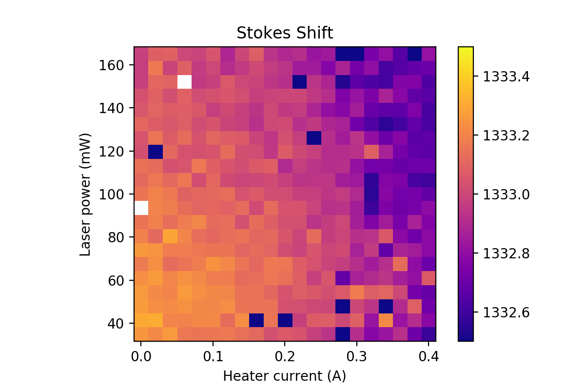
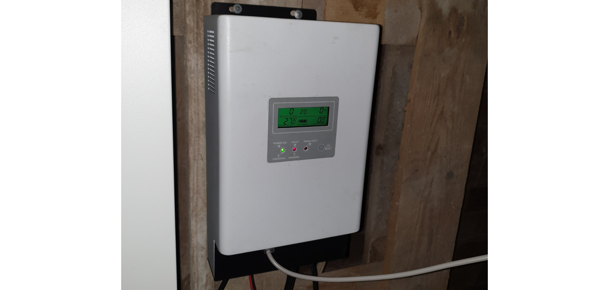
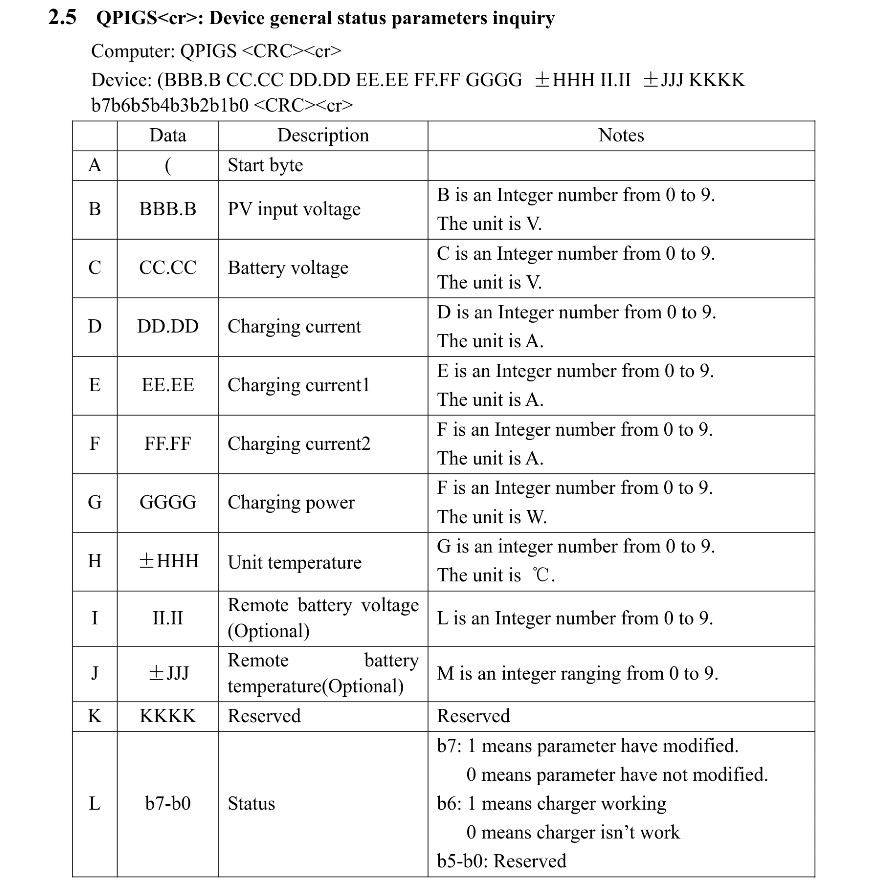
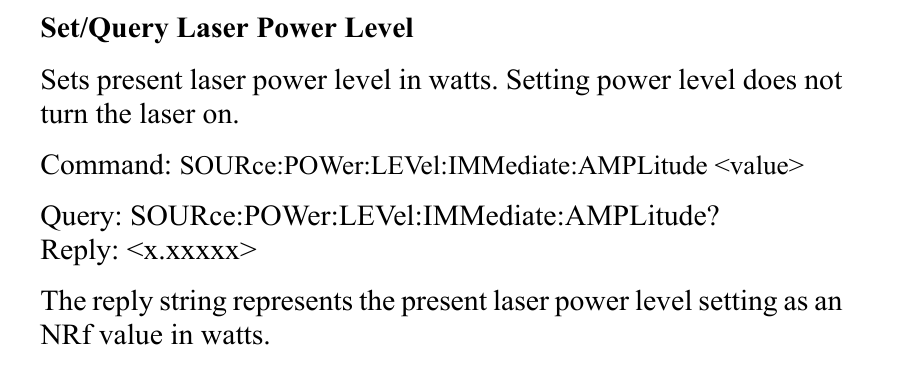
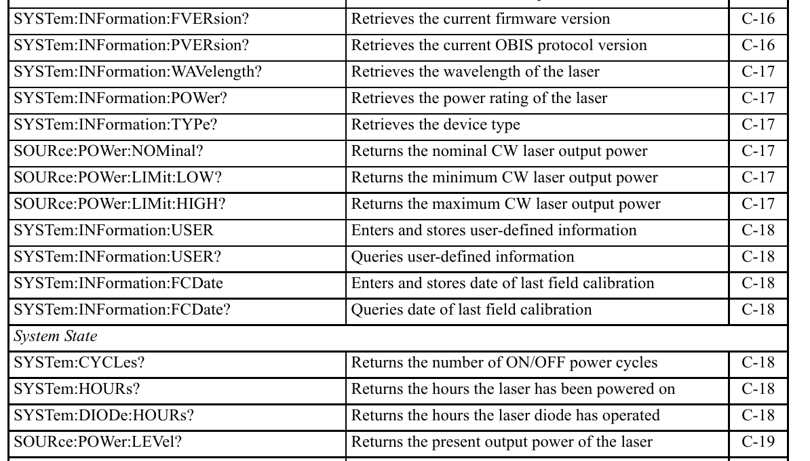
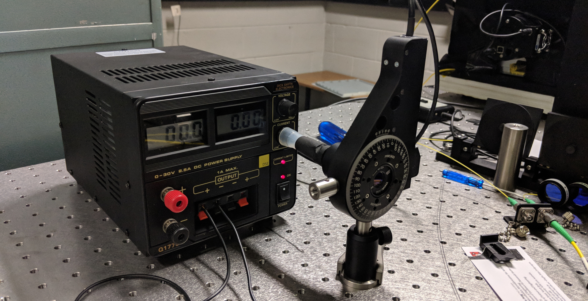

# \_\_equs\_\_.Python workshop 2019
## Day 2 - Putting python to work

# 1. Motivating Python in the lab

In this section we present a variety of case studies to highlight how useful Python can be in the lab, and also to illustrate the range of challenges that can be encountered when talking to hardware.

## 1.1 Automated experimentC

### Topical example

Consider the following dataset, which was presented at the AIP Congress in Perth. The distance between two peaks in a photoluminescence spectrum ("Stokes shift") is shown versus both heater current and laser power.




This measurement consists recording spectra at two wavelengths, at every combination of laser power and heater current (both divided into a range of 20 values). That's 400 measurement points, and each spectrum can take as long as 20 minutes for the low laser powers!

Far too laborious even for a Masters student...


It's actually not about the problem of labour. Humans work slow and make mistakes.

### Structuring the problem

We can think of this experiment as:
- For each heater current:
  - For each laser power:
    - Record the spectra.
    - Find the peak positions.
    - Calculate the distance between them ("shift").

This looks quite a lot like nested `for` loops!

And the image is for just one nanodiamond; in the lab this measurement was repeated for numerous nanodiamonds. We could achieve this with another layer of `for` loop.

*(Yes, the dataset shown above really did take days to measure even with round-the-clock autonomous operation)*

### Gluing multiple devices together

Doing this experiment autonomously requires Python to:
- adjust the heater current (control a power supply),
- set the laser power,
- acquire spectra,
- re-align on the fluorescent ND to counteract physical drift of optical alignment.

Clearly we need to think a bit about Python and hardware.

## 1.2 Text-based querying for logging (PCM60x charge controller)



Excellent simple example as a warm-up. The charge controller for my home-built solar-charged home battery. I wanted to produce a live online plot of the charging current and battery voltage so that I could monitor progress while not at home.

I went searching online for what might be possbile in Python, and after some time (measured in days) I found https://github.com/solarsnoop/PCM60X-Monitor/blob/master/emoncms.py
which gave me the basic idea to follow. Querying the device to log charge current is only a few lines of code:

```python
import serial
# Connect serial
ser = serial.Serial(port='/dev/ttyACM0', baudrate=2400, timeout=2)
ser.write(b"\x51\x50\x49\x47\x53\xB7\xA9\x0D")
result = ser.read(70)
ser.read()
ser.read()
```

The command is pretty cryptic, and was not in the documentation that I could initially find.

Even after getting the communication to work, there was still some effort to interpret the returned information (`'032.3 24.02 00.10 00.00 00.10 0045 +023'`).

More digging, and I found a PDF copy of the "MPPT-3000 Standard RS232 communication Protocol", which explains things a bit further.



Aha, that crazy text string is actually listing the ascii hex codes for "QPIGS" with some end-of-line carriage return characters! I think things are making sense, but what the heck is that table showing two definitions of "F" in the notes column? And what about "M is an integer..."? Where is "M" anyway?

These docs are probably buggy.

Sadly, the docs are mostly buggy.

The really important detail is that the code is simple but the documentation was terrible.

## 1.3 Text-based communication (Coherent Obis laser)

Here is a list of code that sets the output power of this laser:

```python
import serial

eol = '\r'
com_port = 'COM1'

obis = serial.Serial(com_port, timeout=1)

new_power = 10e-3
message = 'SOUR:POW:LEV:IMM:AMPL {}'.format(new_power) + eol
obis.write(message.encode())

time.sleep(0.1)

response_len = obis.inWaiting()
response = []

while response_len > 0:
    this_response_line = obis.readline().decode().strip()
    response.append(this_response_line)
    response_len = self.obis.inWaiting()

# Potentially multi-line responses - need to be joined into string
full_response = ''.join(response)
```

Most of this is quite readable Python code. The message to send to the OBIS laser is a bit cryptic. It can be read as `SOURce:POWer:LEVel:IMMediate:AMPLitude <value>` and is described in the Operators Manual (Appendix C):



Of course, there are plenty more commands available in this communication vocabulary. Appendix C lists more than 3 pages in its opening Quck Reference table:



We want to use many of these commands, but do not want to have to write out the communication structure every time.

**Note:** *Code duplication is EVIL.*

## \*\*\*\* PROBLEM: code duplication (2-3 minutes) \*\*\*\*

Can you think of 2 or more reasons why code duplication is EVIL?

Discuss with people near you.

## \*\*\*\*


So let's write some methods that we can reuse multiple times.

```python
def _send(self, message):
    """ Send a message to to laser
    @param string message: message to be delivered to the laser
    """
    new_message = message + self.eol
    self.obis.write(new_message.encode())
```

That will be enough for some commands, but often we want to know how the device responds to a query. This new method takes `_send` and builds on it to process the response.

```python
def _communicate(self, message):
    """ Send a receive messages with the laser
    @param string message: message to be delivered to the laser
    @returns string response: message received from the laser
    """
    self._send(message)
    time.sleep(0.1)
    response_len = self.obis.inWaiting()
    response = []

    while response_len > 0:
        this_response_line = self.obis.readline().decode().strip()
        if (response_len == 4) and (this_response_line == 'OK'):
            response.append('')
        else:
            response.append(this_response_line)
        response_len = self.obis.inWaiting()

    # Potentially multi-line responses - need to be joined into string
    full_response = ''.join(response)

    if full_response == 'ERR-100':
        self.log.warning(self._model_name + ' does not support the command ' + message)
        return '-1'

    return full_response
```

We don't want to remember all those cryptic commands. Let's make a method to set power in a more user-friendly way.

```python
def set_power(self, power):
    """ Set laser power
    @param float power: desired laser power in watts
    """
    self._communicate('SOUR:POW:LEV:IMM:AMPL {}'.format(power))
```

## \*\*\*\* PROBLEM: What's `encode()` (5 minutes) \*\*\*\*

Do a quick search online to find out what the `encode()` method does.

- Open an ipython console and make a variable holding some string.
- Print that string, and then print the string "encoded".
- Check that `decode()` does what it should do (take an "encoded" string and return it to a plain string)

## \*\*\*\*


## 1.4 Thorlabs APT-motor rotational stage (Windows DLL and ctypes)

Sometimes there will be a DLL file giving us access to the device driver.

```python
from ctypes import c_long, c_buffer, c_float, windll, pointer

path_dll = 'thirdparty/thorlabs/win64/APT.dll'
aptdll = windll.LoadLibrary(path_dll)

SERIAL_NUM = 11782019
SerialNumber = c_long(SERIAL_NUM)

result = aptdll.InitHWDevice(SerialNumber)
if result == 0:
    print('initializeHardwareDevice connection SUCESS')
else:
    raise Exception('Connection Failed. Check Serial Number!')

# Get position
position = c_float()
aptdll.MOT_GetPosition(SerialNumber, pointer(position))

print('motor at {} degrees'.format(position.value))

# Rotate to position
new_pos = 45.0
absolutePosition = c_float(new_pos)

wait_until_done = True
aptdll.MOT_MoveAbsoluteEx(SerialNumber, absolutePosition, wait_until_done)
```

Loading the DLL gives us an object that has methods which can be called. This is elegant.

The requirement to think of variables with C mentality may be a serious stumbling block for python programmers. 


## 1.5 Deeper levels of hell 

When working with hardware, you are at the mercy of whoever designed the hardware and its programming interface. This is the most frustrating example I have ever encountered. With this piezo stage, the only way out was to use python to send text strings of visual basic code through to a device...

```python
# Move to new_pos

to_pos = new_pos /1e-6  # NT-MDT scanner communication in microns

command = ('SetParam tScanner, scPosition, {scanner}, {channel}, {position}\n'
            'Do\n'
            'idle\n'
            'Loop Until GetParam(tScanner, cStatus, {scanner}) = False'
            .format(channel=channel, position=to_pos, scanner=scanner))

novadll.RunScriptText(command.encode())
time.sleep(0.1)
```

When we need to query some parameter and ask it to send the info back to us, things get worse! Again we need to send a command as visual basic in a string. Then we ask it to set a value in a shared memory (requiring `c_types`) and then use `c_types` in python to access the value that was set in that memory slot.

```python
pos_dict = {}

for axis in ['x', 'y', 'z']:
    command = ('{axis}Pos = GetParam(tScanner, scPosition, {scanner}, {channel})\n\n'
               'SetSharedDataVal "shared_{axis}Pos", {axis}Pos, "F64", 8'
               .format(axis=axis, channel=channel, scanner=scanner)
              )


    novadll.RunScriptText(command.encode())
    time.sleep(0.1)

    variable = 'shared_{axis}Pos'.format(axis=axis)

    outbuf = ctypes.c_double()
    buflen = ctypes.c_int()

    novadll.GetSharedData(variable.encode(), None, ctypes.byref(buflen))  # get the required buffer size
    novadll.GetSharedData(variable.encode(), ctypes.byref(outbuf), ctypes.byref(buflen))  # fill the buffer

    pos_dict[axis] = outbuf.value * 1e-6  # NT-MDT scanner communication in microns

```

## 1.6 

Sometimes the only way out is some creative thinking!

